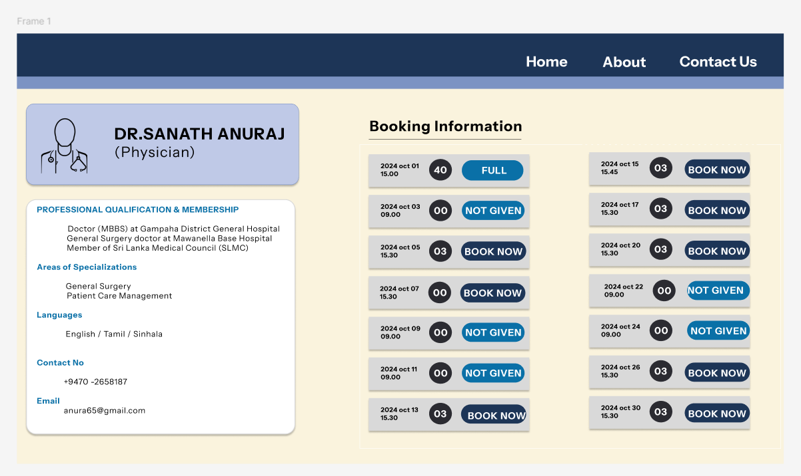

# **Clinical Management System**

 This project aims to develop a web application for a health center's clinical management system. The main features include:

	1. Appointment Booking: Patients can search for and select doctors based on their specialization.
 
	2. Appointment Confirmation: Once the appointment is confirmed, a bill is generated.
 
	3. Doctor Consultation: Patients can meet the doctor at the booked time and receive medicine and advice.
 _______________________________________________________________________________________________________________________________________________

## UI design
I designed the user interfaces using Figma, following a specific color palette to maintain a consistent and professional look.

_______________________________________________________________________________________________________________________________________________
## •	ER diagram

Additionally, I created an Entity-Relationship (ER) diagram and mapped the relationships for this system.

